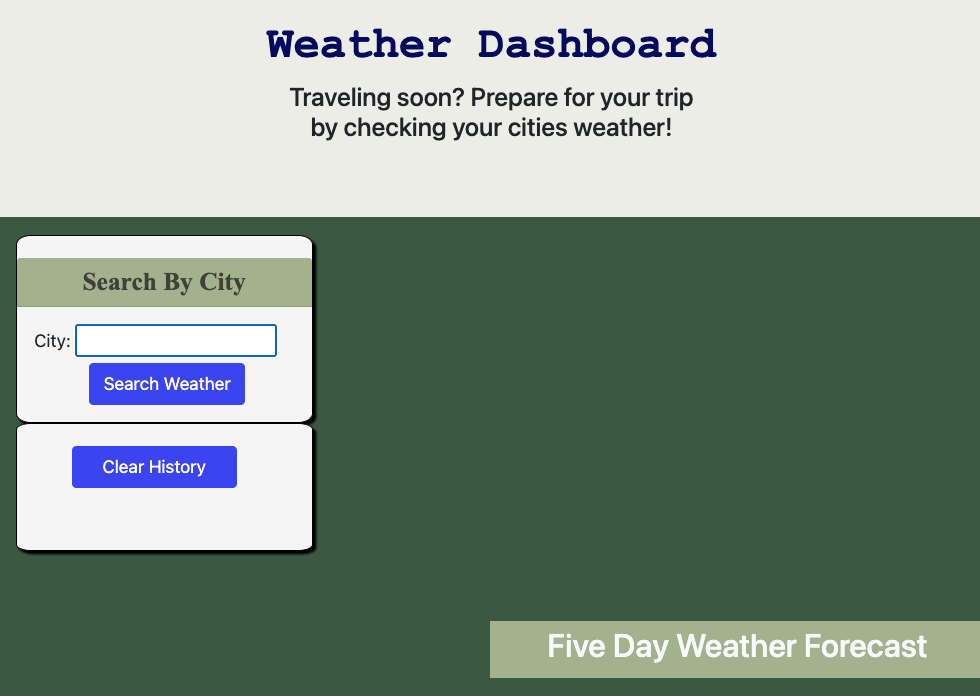
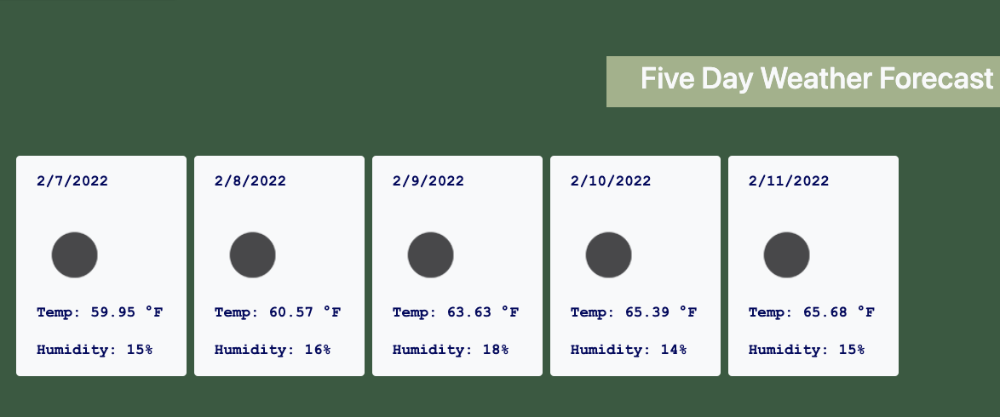

# Weather Dashboard
 The goal of this challenge was to allow travelers to see the weather outlook for multiple cities so that they can plan a trip accordingly.

 ## Challenge Acceptance Criteria

- GIVEN a weather dashboard with form inputs
- WHEN I search for a city
- THEN I am presented with current and future conditions for that city and that city is added to the search history
- WHEN I view current weather conditions for that city
- THEN I am presented with the city name, the date, an icon representation of weather conditions, the temperature, the humidity, the wind speed, and the UV index
- WHEN I view the UV index
- THEN I am presented with a color that indicates whether the conditions are favorable, moderate, or severe
- WHEN I view future weather conditions for that city
- THEN I am presented with a 5-day forecast that displays the date, an icon representation of weather conditions, the temperature, the wind speed, and the humidity
- WHEN I click on a city in the search history
- THEN I am again presented with current and future conditions for that city`

### Deployed Application: https://saraoros.github.io/weather-dashboard/

### Personal Challenges While Working On App:

This project truly challenged me in so many ways. Although it was greatly challenging and very time consuming, I also feel like I have learned so much! This challenge forced me to really go above and beyond on reading API documentations properly, learning new ways to code like using 'axios', and watched numerous videos on examples on how to properly use and get information from API's. Although there were many victories on here, there are still some things that need to be improved. I look forward to being able to improve this project in the future.